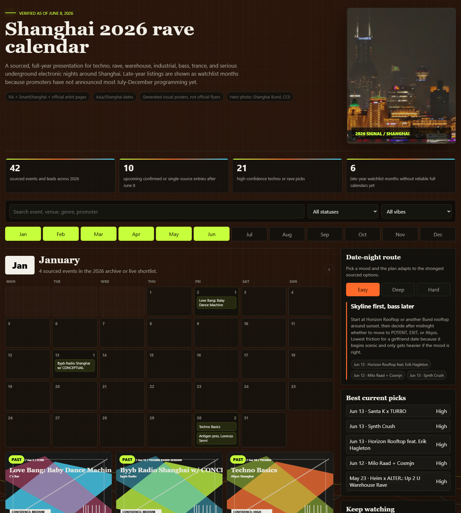

# Shanghai Rave Index

Shanghai Rave Index is an English-first, source-backed Shanghai rave calendar and underground nightlife guide for 2026 techno, house, bass, trance, industrial, experimental club, warehouse, and electronic music events.

[Live calendar](https://raveindexsh.top/) | [Poster wall](https://raveindexsh.top/poster-wall) | [DJ database](https://raveindexsh.top/djs) | [Venue guide](https://raveindexsh.top/venues)



## What it covers

- Shanghai rave and techno events with dates, venues, ticket routes, source confidence, poster evidence, and event deep links.
- DJ and venue discovery for Shanghai underground electronic music, including lineup-derived profiles and itinerary context.
- Static Vercel-ready pages for the calendar, poster wall, live room, planner, Love Wall, subscription flow, contribution intake, and operations console.
- A repeatable event refresh workflow that combines RA, SmartShanghai, venue/promoter sources, ticketing leads, WeChat/Xiaohongshu evidence, and local poster assets.

## Local preview

Open `index.html` directly in a browser, or run:

```bash
npm run scrape
npm run structure
npm run check
npx serve .
```

When served over HTTP, the calendar reads `data/events.json`. If that file is missing or blocked by a direct `file://` preview, the embedded fallback events in the HTML are used.

## Local-only workspace

Use `local/` for anything that should stay off GitHub:

- `local/cache/dj-api/` is the default MusicBrainz/Discogs scraper cache. Override with `DJ_API_CACHE_DIR` when needed.
- `local/source-dumps/` is for raw scraped HTML/JSON captures.
- `local/scripts/` is for one-off scripts, smoke checks, and temporary helpers.
- `local/exports/`, `local/uploads/`, and `local/analysis/` are for operator output, private uploads, and working notes.

The repo also ignores `tmp/`, `.tmp/`, `.uploads/`, `.trae/`, `analysis/`, root `_*.html`/`_*.json` dumps, root `test-*.js` files, and `scripts/_tmp_*.js`.

## Account dispatch

`account.html` provides a Supabase Auth registration/login wall for saved sounds, venues, budget mode, timing, source confidence, and event shortlists. Account tools require sign-in; the public calendar remains open. After login, the homepage reads the same preference profile into the `For you` dispatch panel.

## Alerts and subscriptions

`subscribe.html` is the English-first bilingual alert profile flow for Xiaohongshu-first distribution, email/newsletter intent, and future WeChat/Instagram activation. Submissions save locally immediately and can insert pending rows into the Supabase `subscriptions` table after `supabase/migrations/202606130003_subscriptions.sql` is applied.

## Community contributions

`contribute.html` lets the community submit source-backed missing events, DJ profile evidence, venue details, ticket/source fixes, corrections, and proposed additions to existing event, DJ, or venue entries without writing directly into canonical data. The browser saves each lead locally first, then inserts a pending row into the Supabase `community_contributions` review queue after `supabase/migrations/202606140001_community_contributions.sql` and `supabase/migrations/202606140002_community_contribution_targets.sql` are applied. Submissions record contributor role, optional affiliation, and existing-entry target metadata so moderators can separate community leads, promoter/venue updates, artist evidence, and source fixes before any update reaches `data/events.json`, `data/dj-data.js`, venue pages, or generated event Trust Ledgers.

The event data model now includes derived `soundTags`, `decisionTags`, and `decisionProfile` fields from `scripts/techno-taxonomy.js`. Public pages and `ops.html` use simple tags for sound, room context, ticket/source status, and source-check needs; there is no A/B/C grading layer.

## DJ tracking

`djs.html` builds local performer profiles from Shanghai calendar lineups and gives every DJ a past/future itinerary surface. Each profile always lists its known Shanghai Rave Index appearances, while `data/tracked-dj-itineraries.js` adds curated worldwide tour rows when official or high-signal sources are available. `npm run scrape` preserves curated overlays and regenerates source-backed rows from event `futureTourPlan` fields, then records `djItineraryStats` in `data/events.json`.

## Operations console

Open `ops.html` over the same local or deployed HTTP server to run the operator workflow:

- AI 抓取/整理活动: loads `data/events.json`, combines confirmed events, discovered links, source checks, social leads, and Computer Use source tasks into one intake queue.
- 人工审核: stores approve / needs-check / reject decisions in browser `localStorage` and exports a review JSON file for commit or handoff.
- 微信/小红书分发: generates channel-ready copy for the selected approved event and records local publish timestamps.
- 导票链接: saves local ticket URL overrides, builds UTM-tagged route links, and exports ticket-routing CSV.
- promoter 付费曝光: assigns local paid-exposure packages, budgets, and run-until dates for promoter inventory tracking.
- 数据报表: exports ops CSV, ticket CSV, distribution CSV, and a daily text brief.

The console is intentionally static for this version. It does not post directly to WeChat/Xiaohongshu, process payments, or mutate `data/events.json` without an exported file being reviewed and committed.

### Admin access bootstrap

Ops is gated by Supabase Auth plus `public.profiles.role = 'admin'`; it is not a front-end email allowlist.

1. Open `account.html` and create the owner account with the same email you want to use for Ops. Set an 8+ character password in that Create account form; `ops.html` only signs in after the account exists. Use the magic-link flow if you prefer passwordless login.
2. When you have database SQL access, apply migrations to lock down browser role updates and install the SQL helper:

```bash
npm run supabase:migrate
```

3. Grant the account admin from a trusted local shell with either `SUPABASE_DB_URL`, or `NEXT_PUBLIC_SUPABASE_URL` plus `SUPABASE_SERVICE_ROLE_KEY`, configured:

```bash
npm run admin:grant -- owner@example.com
```

You can also run this in the Supabase SQL Editor after the account has signed in once:

```sql
select *
from public.set_profile_role_by_email('owner@example.com', 'admin');
```

Passwords stay in Supabase Auth. This project only stores the role gate in `public.profiles`.

Account sign-up expects Supabase Auth email confirmation to be disabled so new users can enter immediately after creating a password. Set `SUPABASE_ACCESS_TOKEN` with Auth config write access, then run:

```bash
npm run supabase:auth:no-confirm
```

You can also disable it in Supabase Dashboard under Authentication -> Providers -> Email -> Confirm Email. Magic-link emails should still redirect back to the public account page, not a local dev URL. Add `https://raveindexsh.top/account.html`, `https://raveindexsh.top/account`, and local account URLs to the Supabase Auth redirect allow-list.

## Event refresh

V1 uses GitHub only:

1. `.github/workflows/scrape-events.yml` runs daily or manually.
2. `scripts/scrape-events.js` refreshes public RA and SmartShanghai source data.
3. It checks X/Twitter keyword searches from `config/scrape-keywords.json` as discovery-only social leads.
4. It reads `config/promotion-platform-network.json` and queues Yuyuan first as the preferred local ticketing/core-field platform, then known venue/promoter WeChat, XHS, ticketing, poster, and official-account routes before generic discovery.
5. It writes a `computerUseQueue` for known anti-bot, logged-in, app-only, poster/image, and mini-program sources that the agent should inspect with Chrome + Computer Use.
6. It merges agent-collected, browser-verified event updates from `config/curated-events.json`.
7. For any event with `posterEvidence`, the collector must download the flyer into `assets/posters/`, add a local `posterUrl`, run the poster preparation pipeline, and avoid using remote `images.ra.co` URLs in the UI.
8. The script writes `data/events.json`, `data/dj-data.js`, and `data/tracked-dj-itineraries.js`.
9. The workflow commits the changed data files back to the repository.

RA is the highest-priority public nightlife source. Because plain HTTP fetch currently returns a browser-required RA challenge, complete Shanghai coverage is tracked in `config/ra-shanghai-coverage.json`: each RA Shanghai event URL must map to one canonical event row, and `scripts/audit-events.js` fails when a mapped RA event is missing from generated data. The audit also compares RA's visible upcoming count against the manifest's upcoming rows, so a missed future page or pagination row fails the check instead of silently publishing. `npm run scrape` writes the same snapshot to `data/events.json.quality.raShanghaiCoverage`.

When RA or another direct event source exposes event-level genre, use that genre for the event record before artist or DJ profile genres. Artist genres remain context only because performers can choose a different sound for a specific booking.

`data/events.json.quality.watchQueue` separates `sourceCount` from `confirmationSourceCount`. Social index previews, artist profiles, venue context, radio context, previous-series pages, and off-city festival context stay useful as leads, but they do not count as confirmation sources for the current event. The audit reports `singleConfirmationWatch` so editors can prioritize Watch rows that still need a direct RA, venue, promoter, ticketing, SmartShanghai, or official source.

`data/events.json.quality.platformVerificationQueue` lists Watch rows that already have Instagram, Xiaohongshu/XHS, WeChat, Weibo, mini-program, or ticket-flow leads but still need platform-native Browser/Chrome verification. Use the provided search queries first, then open visible account/post results; do not treat search-index snippets, profile metadata, image placeholders, login walls, or public-session timeouts as event confirmation.

`data/events.json.promotionPlatformQueue` and `data/events.json.quality.promotionPlatformNetwork` come from `config/promotion-platform-network.json`. This is the venue/promoter graph: RA stays first as the highest-priority public nightlife source, then Yuyuan WeChat mini-program runs as the preferred local ticketing/core-field platform, then official venue/promoter WeChat, XHS, poster, and account routes for Heim, Wigwam, Abyss, ILLUM, EXIT, Yuyintang, POTENT, Reactor, Dirty House, Specters, and known promoters before generic keyword searching. `quality.promotionPlatformNetwork.unmappedFutureVenues` lists future venues that still need a platform network.

Static browsing does not require a database. Supabase is used when configured for backend tables, Love Wall submissions, account personalization, and imported poster archive metadata.

When a human supplies WeChat, XHS, ticketing, venue, promoter, or poster screenshots for new events, follow `docs/SCREENSHOT_EVENT_INGEST_WORKFLOW.md`: keep full screenshots as evidence, crop ticketing UI away from poster-wall covers, fill current/future core fields first, mark missing age/ticket URL/running order as gaps, and avoid fake public ticket URLs.

## Poster compression and upload

Save raw poster files under `assets/posters/` and reference the raw local path in the event `posterUrl`, for example `assets/posters/event-slug.png`.

```bash
npm run posters:prepare
```

That command writes compressed display files as `assets/posters/event-slug-optimized.jpg` for every poster source, then regenerates `data/poster-archive.json` so `image.display` and `image.thumbnail` point at the optimized asset. `npm run scrape` runs this same preparation step after refreshing event data.

To push the updated poster metadata into Supabase:

```bash
npm run posters:upload
```

Supabase stores the poster paths and metadata in `poster_archive` and uses the optimized display path for imported `events.poster_url`; the actual images stay in the repo and are served as static assets after deployment. Use `npm run posters:optimize -- --force --all --allow-larger` to rebuild existing optimized files.

## Website structure and theme

The static page inventory is tracked in `config/website-structure.json`. Update that file when adding, renaming, or removing a page, then run:

```bash
npm run structure
npm run check
```

Future pages should follow the Basement Dispatch theme contract in `docs/WEBSITE_THEME.md` and the page/routing rules in `docs/WEBSITE_STRUCTURE.md`. The shared stylesheet is `assets/basement-dispatch.css`; generated event pages also use `assets/event-detail.css` and the shared rendering helpers in `scripts/site-components.js`.

X/Twitter leads are stored under `socialLeads` in `data/events.json`. They do not become calendar cards until confirmed by RA, SmartShanghai, venue/promoter, ticketing, or another stronger source.

For reliable X/Twitter collection, add either `X_BEARER_TOKEN` or `TWITTER_BEARER_TOKEN` as a GitHub repository secret. Without a token, the workflow records the configured keyword searches but does not collect posts by default. To attempt unauthenticated public HTML search, set `SCRAPE_X_PUBLIC_SEARCH=true`, but expect frequent empty or blocked responses from X/Twitter.

Known anti-bot or app-bound sources are not scraped with plain `fetch`. They are queued for agent-operated Chrome + Computer Use in `computerUseQueue`: RA Shanghai when blocked, Yuyuan WeChat mini-program as the first local ticketing/core-field route, entity-specific promotion-platform tasks from `promotionPlatformQueue`, SmartShanghai when fetch is incomplete, Xiaohongshu, WeChat official accounts/groups, venue official accounts, promoter posters, ShowStart/Damai/PiaoPlanet ticketing, and DJ/label Instagram, Weibo, WeChat, or Bandcamp pages. Treat these as discovery or verification tasks until the agent captures a shareable official/ticket/source reference or screenshot evidence. In Yuyuan, use only list/detail-page reading: capture title, date, time, venue/address, lineup/running order, price tier, e-ticket/standing/no-refund labels, customer-service route, and poster cover; do not click purchase/payment and do not fabricate a public `ticketUrl`.

Computer Use collection should be complete, not just a title scrape. For each event, follow second-layer links and extract image/poster text when needed to capture time, venue/address, lineup and set times, poster evidence, artist introductions, future city tour dates, ticket platform/price/availability, age/ID rules, source publication dates, and whether each detail came from official, ticketing, social, or image-derived evidence. Poster evidence is not complete until the poster image has been saved under `assets/posters/` and referenced through a local `posterUrl`.

`config/curated-events.json` is the persistent handoff for those agent-collected details. Use it for browser-confirmed RA, SmartShanghai, WeChat, Xiaohongshu, mini-program, poster, or social-account details that should survive every automated refresh without adding brittle anti-bot scraping logic to GitHub Actions.

When RA city listing fetches are blocked, update RA through this route: RA city/date listing plus pagination such as `page=2` in Browser or publicly indexed text, then each RA event detail page, then `config/ra-shanghai-coverage.json`, then `config/curated-events.json` for any new or corrected event details. Do not treat an RA challenge page as an empty listing.

`npm run check` and `npm run audit` enforce the poster handoff rule: any event with `posterEvidence` must have a valid downloaded local `assets/posters/...` image. If this fails, use Chrome/Computer Use or `curl` to download the flyer, then update `config/curated-events.json`, generated `data/events.json`, and the mirrored calendar poster override map when needed.

## Deploy

The project is static and can be deployed on Vercel with no build step:

```bash
vercel --prod
```

<!-- discoverability:start -->
## Discoverability

- **Project:** Shanghai Rave Index
- **Summary:** English-first, source-backed Shanghai rave calendar and underground nightlife guide for electronic music events, DJs, venues, tickets, and poster evidence.
- **Primary keywords:** shanghai, rave-calendar, techno, nightlife, electronic-music, club-events, venue-guide, dj-database, poster-archive, static-site, supabase, vercel
- **Use cases:** Shanghai rave and club event discovery, DJ, venue, ticket, and poster research, Static event calendar publishing
- **Live URL:** https://raveindexsh.top/
<!-- discoverability:end -->
